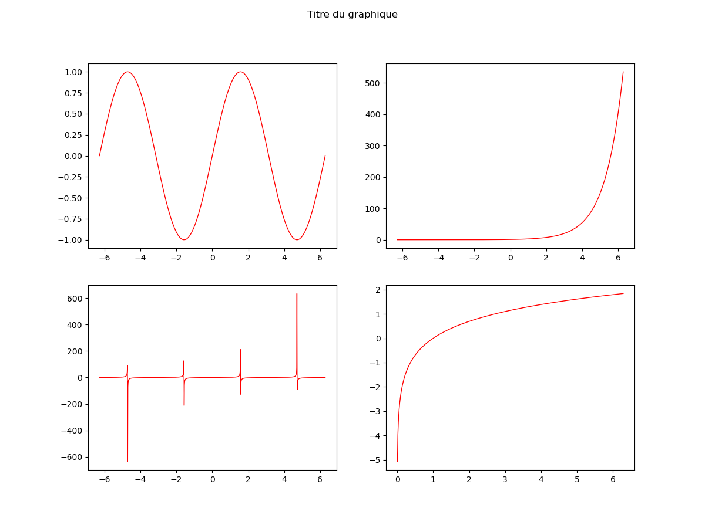

---
jupytext:
  encoding: '# -*- coding: utf-8 -*-'
  formats: ipynb,md:myst
  split_at_heading: true
  text_representation:
    extension: .md
    format_name: myst
    format_version: 0.13
    jupytext_version: 1.10.3
kernelspec:
  display_name: Python 3
  language: python
  name: python3
---

# Matplotlib : tracés graphiques

Le module `matplotlib` permet le tracé graphique à partir de listes de valeurs (ou plus souvent de vecteurs `numpy`). 

## Importation du module

La grande majorité des fonctions utiles sont dans le sous module `pyplot`, c'est pourquoi, on importera directement `matplotlib.pyplot` :

```{code-cell}
import matplotlib.pyplot as plt
```

```{admonition} Question
:class: tip
Pour utiliser la fonction `subplots` de la bibliothèque `matplotlib.pyplot`. On utilise alors `subplots(...)` ou `plt.subplots(...)` ?
```

```{dropdown} Cliquez pour avoir la réponse.
On a importé `matplotlib.pyplot` dans un espace nommé `plt`, on utilisera donc la syntaxe `plt.subplots(...)`.
```

## Eléments d'un graphique
Les éléments principaux sont données sur le schéma ci-dessous.


On distinguera par la suite la fenêtre graphique des axes (endroit où on trace des courbes) : une fenêtre graphique peut contenir plusieurs axes comme sur l'exemple suivant (4 axes ou zone de tracé).



## Méthode générale

### Un exemple basique

```{code-cell}
"""
On crée les données à tracer. Ici le tracer d'une fonction sinus
"""
import numpy as np  # Les vecteurs numpy sont plus facilement manipulables.
x = np.linspace(0, 2 * np.pi, 1000)  # 1000 points espacés entre 0 et 2pi
y = np.sin(x)  # Numpy permet d'appliquer sin() aux 1000 points en une ligne.


"""
On crée maintenant le graphique
"""
f, ax = plt.subplots()  # On crée la fenêtre graphique et les axes (= zone de tracé, ici une seule zone)

f.suptitle("Titre du graphique")  # On donne un titre au graphique

ax.set_xlabel("Temps (s)")  # On légende les abscisses de la zone de tracé
ax.set_ylabel("Position (m)")  # On légende les ordonnées de la zone de tracé

ax.plot(x, y, label="Légende")  # On trace la courbe voulue

ax.legend()  # On affiche la légende de la zone de tracé

ax.grid()  # Optionnel : permet d'afficher une grille sur le graphique

plt.show()  # On demande d'afficher le graphique.
```

### Remarques sur le code
* `subplots` créer une fenêtre graphique avec une zone de tracé. On affecte la fenêtre graphique et les axes (zone de tracé) à des variables (ici `f` et `ax`) pour être sûr d'affecter le titre au bon graphique (si on doit en utiliser plusieurs) ou aux bons axes (idem).
* Le `f.` permet de modifier spécifique la fenêtre graphique associée. On peut ajouter un titre à la fenêtre graphique `f` (`f.suptitle`).
* Idem pour `ax.` qui permet de légender les axes (`ax.set_xlabel(...)`) et d'y tracer un graphique (`ax.plot(...)`).
* La légende est __affichée__ par la méthode `legend()` mais pour légender __une courbe__ il faut utiliser l'argument `label="chaine de caractère"` dans la fonction `plot`
* `show` permet d'afficher les graphiques qui ont été créé.

### Les types de courbes utiles.

#### Fonctions utiles
Sans être exhaustif, on donne trois types de courbes utiles :
1. tracé d'un histogramme : `hist(liste_valeurs, bins='rice')`
```{toggle}
* L'argument `bins='rice'` est optionnel (ou remplaçable par `bins=1000`) mais il permet de demander à Python d'ajuster le nombre de bâtons de l'histogramme en fonction du nombre d'éléments de `liste_valeurs`.

Ca évite de tracer 10 bâtons quand on a 1000000 valeurs...
```

2. tracé d'un nuage de points (reliés ou nom) : `plot(vecteur_abscisse, vecteur ordonnee)` 
3. tracé d'un nuage de points (reliés ou nom) avec incertitudes : `errorbar(vecteur_abscisse, vecteur ordonnee, xerr=vecteur_incertitude_sur x, , yerr=vecteur_incertitude_sur y)`

```{toggle}
* Si toutes les incertitudes sont identiques, on peut mettre une valeur seule au lieu d'un vecteur
* On peut ne donner qu'une seule des deux incertitudes (sur y seulement par exemple). On trace avec des barres d'incertitude au lieu des croix d'incertitude).
```

#### Arguments optionnels utiles
Les fonctions précédentes permettent d'utiliser des arguments optionnels pour modifier l'allure de la courbe ou légender la courbe. 

```{code-block}
# Un exemple :
ax.plot(x, y, marker='+', linestyle='', color='red', label='Nuages')
"""
On trace ainsi les points (x[i], y[i]) :
- sans relier les points (linestyle = '')
- en plaçant des marqueurs + pour chaque points (marker = '+')
- en rouge (color = 'red')
- avec comme légende "Nuages" (label="Nuages")
"""
```

On cite les plus utiles :

`````{tab-set}
````{tab-item} Pour plot et errorbar
* `linestyle` : style de ligne qui relie les points (non exhaustif):
    * `linestyle = ''` : pas de ligne
    * `linestyle = '-'` : ligne continue
    * `linestyle = ':'` : pointillés
* `marker` : type de marqueurs pour les points (x[i], y[i]) :
    * `marker = '+'`
    * `marker = '*'`
    * `marker = 'o'`
    * `marker = ''` : pas de marqueurs
* `label = 'La légende'` : associer une légende à une courbe
* `color = 'nom_de_couleur_en_anglais'`
````

````{tab-item} Pour hist
* `label = 'La légende'` : associer une légende à une courbe
* `color = 'nom_de_couleur_en_anglais'`
````
`````

## Autres fonctions et arguments
La liste présente les plus importantes et à connaître. Vous en rencontrerez peut-être d'autres (pas à connaître):
* pour sauvegarder la figure
* pour mettre une échelle logarithmique sur les abscisses
* pour ajuster l'apparence des barres d'incertitudes
* pour ajuster la taille de la courbe
* pour ajouter du texte ou des flèches

## Pour vous entraîner
Voici le [lien vers les exercices pour vous entraîner sur l'utilisation de numpy et matplotlib](https://pcsi3physiquestan.github.io/intro_python_td/notebook/exo_science.html)