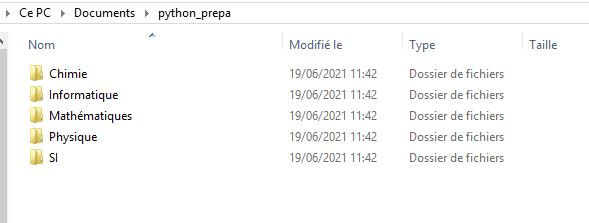

---
jupytext:
  encoding: '# -*- coding: utf-8 -*-'
  formats: ipynb,md:myst
  split_at_heading: true
  text_representation:
    extension: .md
    format_name: myst
    format_version: 0.13
    jupytext_version: 1.10.3
kernelspec:
  display_name: Python 3
  language: python
  name: python3
---

# Environnement de développement.
Un environnement de développement (IDE) est un logiciel permettant d'écrire du code Python et de l'interpréter grâce à l'interface du logiciel. Il existe de nombreux IDE pour Python. Celui conseillé pour l'instant est Pyzo, une présentation rapide a été donnée avec [le tutoriel sur l'installation de Pyzo](https://filedn.com/lykEJ3axFalJygD0EVAUyWS/Stan/Pyzo_Anaconda/Python_pyzo_insta_gen_auroraW/index.html).

## Quelques bonnes pratiques.
Vous serez amenés à créer des fichiers contenant vos scripts ou à récupérer des fichiers donnés par vos enseignants. Il est donc important de savoir où les enregistrer pour les utiliser sous Pyzo. L'organisation sera de plus importante lorsqu'il sera question de manipuler des fichiers de données expérimentales.

Il est donc conseillé de créer un répertoire spécifique dans lequel vous enregistrerez vos fichiers. Pour cela, il suffit d'ouvrir l'_explorateur de fichiers_ (Windows) ou _Finder_ (MacOs) pour créer un répertoire.  __Préférez créer votre répertoire dans le répertoire `Documents` (ou `MesDocuments`)__, cela facilitera l'accès aux fichiers si vous êtes amenés plus tard à utiliser des logiciels comme Jupyter. Dans l'exemple ci-dessous, un dossier `python_prepa` a été créé dans `Documents`. _Plusieurs sous dossiers pour chaque matière ont été créés, à vous de vous organiser au mieux par la suite._



# Indentation
L'indentation est le décalage de certaines lignes de code appartenant au même bloc (corps d'une fonction, d'une boucle...). On décale (on indente) une ligne grâce à `Espace` (plusieurs fois) ou `Tab`.

```{code-block}
n = 10  # Code non indenté
for i in range(n):  # Démarrage d'une boucle : le corps de la boucle doit être indenté
    a = i ** 2  # Partie indenté
    b = a + 2
    print(b)  # Fin de la partie indenté (donc du bloc)
```

Dans beaucoup de langage, l'indentation est optionnelle pour rendre le code plus lisible. Dans Python, __elle est obligatoire__ pour définir l'ensemble d'instructions qui feront partie d'un même bloc (ensemble d'instruction d'une fonction par exemple). Les blocs (fonction, condition, boucle) seront présentés ensuite.


# Les types et opérations usuelles.
On ne décrit ici que les types simples et les opérations que nous utiliserons le plus. D'autres types plus particuliers ou issus de bibliothèques non standards seront présentés plus tard.

```{tabbed} Les entiers
Type : `int`
Exemple : `3` ou `123543654` ou `-3465`

Opérateur/Fonctions usuelles :
* Addition : `3 + 4`
* Soustraction : `3 - 4`
* Multiplication : `3 * 4`
* Division entière : `5 // 3` (renvoie 1)
* Reste de la division euclidienne : `5 % 3` (renvoie 2)
* Puissance : `3 ** 2` (renvoie 9)
```

````{tabbed} Les flottants (nombres réels)
Type : `float`
Exemple : `3.45`ou `3254.234` ou `-23.34` ou `3.` ou `-5.` (observez le `.` après le 3 et le 5).

Opérateur/Fonctions usuelles :
* Addition : `3.2 + 4.1`
* Soustraction : `3. - 4.5`
* Multiplication : `3.1 * 4.2`
* Division : `3.3 / 4.`
* Puissance : `3.3 ** 4.`

```{note}
Une opération entre un entier et un flottant est possible, elle renverra un flottant.
```
````


```{tabbed} Les booléens (Vrai ou Faux)
Type : `bool`
Exemple : `True`, `False`

Opérateur/Fonctions usuelles :
* Négation : `not`
* Ou : `or`
* Et : `and`
```

````{tabbed} Les chaines de caractères
Type : `str`
Exemple : `"Hello World !"`, `"Les guillemets sont importantes"`, `'Ou des apostrophes'`

Opérateur/Fonctions usuelles :
* Concaténation : `"Hello" + "World !"` renvoie `"HelloWorld !"`
* Longueur : `len("Hello")` renvoie `5`
* Transformer un nombre en chaine de caractère : `str(345.2)` renvoie la chaine de caractère `"345.2"`
* Accès à un caractère : `"Hello"[0]` renvoie `"H"`, `"Hello"[4]` renvoie `"o"`,

```{attention}
La position des caractères commence à 0 et non à 1
```

````

Il existe aussi d'autres fonctions générales qui s'appliquent sur les différents types comme `print(...)` qui sert à afficher l'objet considéré.

# Variables et affection
Une variable est un élément servant à stocker des données dans un espace mémoire dédié.

## Affection
On utilise le signal `=`. Ci dessous l'affection de l'entier `1` dans la variable `a`

```{code-cell}
:tags: [remove-output]
a = 1
```

```{important}
Affecter n'est pas afficher. Si vous voulez afficher le contenu d'une variable, il faut utiliser la fonction `print(nom_de_variable)`.
```

## Manipulation
Une variable peut être utilisée par les opérateurs et fonctions associées au type de la données stockées. Par exemple, avec des flottants :

```{code-cell}
longueur = 8.2  # Affection du flottant 8.2 dans la variable longueur
largeur = 3  # Affection de l'entier 3 dans la variable largeur
aire = longueur * largeur  # Calcul du produit. aire est un flottant
print(aire)  # On affiche la valeur calculée.
```

## Type d'une variable
Pour connaître le type d'une variable, on utilise la fonction `type()` :

```{code-cell}
a = 3
print("Le type de cette variable est : " + str(type(a)))
a = 3.34
print("Le type de cette variable est : " + str(type(a)))
a = "Une phrase !"
print("Le type de cette variable est : " + str(type(a)))
a = True
print("Le type de cette variable est : " + str(type(a)))
```

## Règles de nommage
Un nom de variable :
* peut contenir des lettres (minuscules ou majuscules), des chiffres, le caractère `_`
* ne peut pas commencer par un chiffre
* ne peut être un mot reservé par python (comme `print`) (Python renverra une erreur le cas échéant donc pas la peine d'apprendre ces mots par coeur !)

# Les listes
Les listes sont des objets Python un peu plus complexes qui permettent de stocker, un ensemble d'objets dans un ordre choisi.

## Créer et manipuler une liste
```{margin}
`list` est une fonction dans Python, on évitera de l'utiliser comme nom de variable
```

* Créer une liste vide : `l = []`
* Créer une liste à partir de données : `l = [3, "phrase", 4.2, "teste"]`
* Ajouter un élément à une liste `l2` __à la fin__ : `l2.append("Un ajout")`
* Concaténer deux listes `l1` et `l3` : `l1 + l3`

```{code-cell}
"""Liste vide"""
l1 = []
print(l1)

""" Liste remplie"""
l1 = [3, "phrase", 4.2, "teste"]
print(l1)

""" Ajout d'un élément"""
l2 = [1, 2]
l2.append(4.3)
print(l2)

""" Concaténation"""
l = l1 + l2
print(l)
```

```{margin}
On peut mettre n'importe quel type de données (ou presque) dans une liste et notamment... des listes ! On peut donc créer une liste de liste ce qui se rapproche le plus d'un tableau.
```

## Extraction
### Un élément
On peut extraire un élément d'une liste comme pour une chaine de caractère :

```{code-cell}
l = [1, 3, 5, 7, 9]

a = l[0]  # On commence le positionnement à 0
print(a)  # Renvoie 1
a = l[3]  # Il s'agit du... quatrième élément
print(a)  # Renvoie 7
a = l[5]  # Il n'y a pas de 6ème élément : Python affiche une erreur.
```

```{margin}
Vous pouvez retenir le message d'erreur très significatif : `index out of range`. Reconnaître les messages d'erreurs est utile pour corriger son code.
```

```{tip}
On peut utiliser des nombres négatifs pour "partir de la fin", le nombre -1 désigne alors le __dernier élément de la liste__.


Dans l'exemple précédent, `l[-1]` renvoie `9` et `l[-2]` renvoie `7`.
```

### Une partie de la liste
On peut extraire un ensemble d'éléments d'une liste (on obtient alors une liste).

`l[3:6]` : on commence au 4ème élément (l'indexation commence à 0) et on s'arrête au 7ème élément __non inclus__.

```{code-cell}
l = [1, 3, 5, 7, 9]

a = l[2:4] # renvoie la portion du troisième élément (5) au cinquième non inclus, donc on s'arrête à 7
print(a)
```

```{admonition} Syntaxes utiles :
:class: tip
* `l[1:]` : renvoie depuis le deuxième élément jusqu'à la fin de la liste (précédemment :  `[3, 5, 7, 9]`).
* `l[:3]` : renvoie du début de la liste jusqu'au 4ème élément __non inclus__  (précédemment :  `[1, 3, 5]`).
* On peut utiliser les nombres négatifs comme présentés précémment.
```


## Fonctions de bases
Plusieurs fonctions de bases s'appliquent à une liste (ici la liste s'appellera `l`).

* Longueur de la liste : `len(l)`
* Enlever le (i+1)ème élément de la liste `l` : `l.pop(i)` (__C'est bien la variable `l` qui est modifiée comme pour append__).

# Les commentaires
On peut ajouter des commentaires (parties non interprêtées) :
* commentaires sur une ligne avec `#`
* commentaires sur plusieurs lignes entre `"""` et `"""`